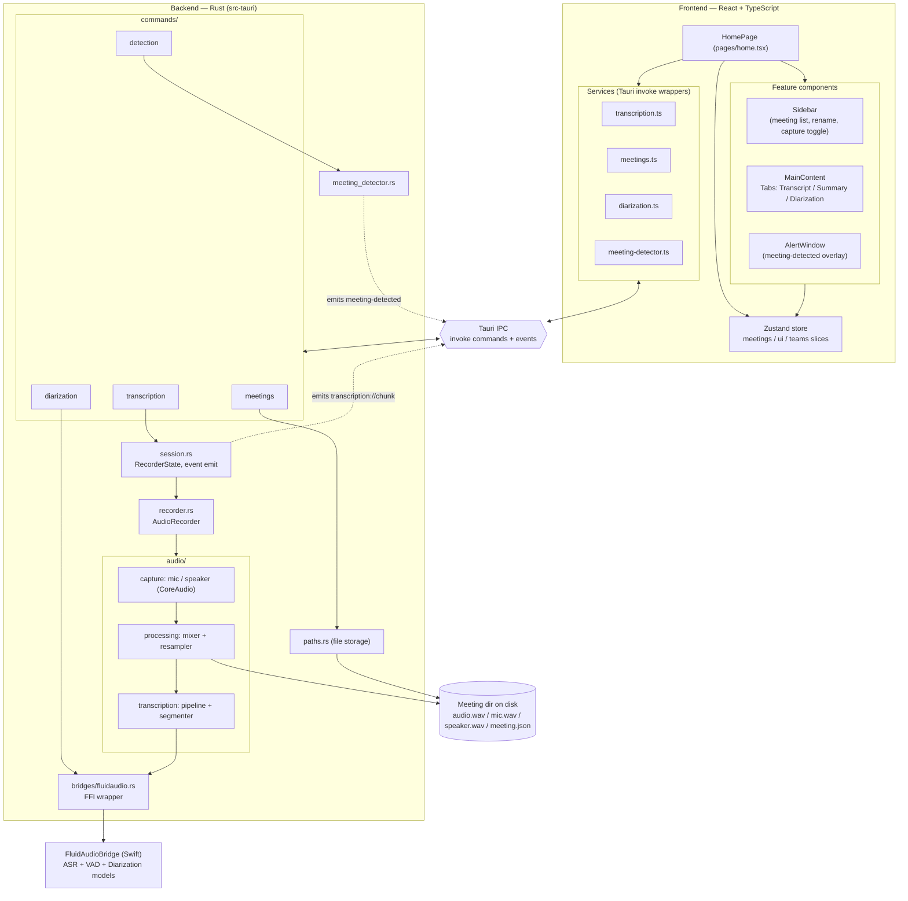
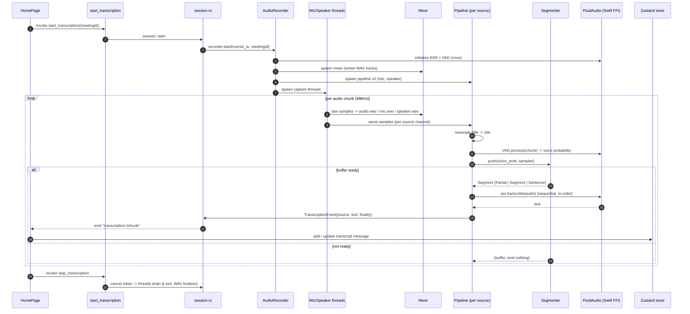

# Meeting Noter — Architecture

Tauri desktop app (macOS). React/TS frontend, Rust backend, Swift `FluidAudioBridge`
for on-device ASR / VAD / diarization. All processing is offline/local.

## 1. System architecture

## 2. How transcription works (live capture)

### Segmenter finality (what drives partial vs final text)

| Finality   | When                                          | Frontend effect                  |
|------------|-----------------------------------------------|----------------------------------|
| `Partial`  | While speaking, throttled preview             | Updates current message (live)   |
| `Segment`  | Buffer hits flush/max size during long speech | Commits text, keeps same message |
| `Sentence` | Silence lasts past threshold                  | Ends message, next starts new    |

Key properties:
- One pipeline per source (mic, speaker) → independent VAD state, no cross-talk.
- ASR runs **sequentially per stream** → results never arrive out of order; stale
  partials are dropped when newer audio is already queued.
- Mixer writes three WAVs: `audio.wav` (mixed), `mic.wav`, `speaker.wav` — the
  per-source tracks feed offline diarization later.
