# How transcription works

Meeting Noter turns a live conversation into text **entirely on your Mac** — no
audio, ever, leaves the machine. Here's the whole path, from microphone to the
words on screen.

  

> The diagram above is animated. It plays in a browser, in VS Code's Markdown
> preview, and on GitHub Pages. (github.com renders it as a still frame — open the
> SVG directly to see the motion.)

## The idea in one line

Your mic and the other side (system/speaker audio) are captured as **two
separate streams**, each transcribed independently, so cross-talk never garbles
either side. Everything runs on-device on Apple's Neural Engine.

## The five stages

### 1 · Capture — two streams, always separate

The **microphone** (you) and the **speaker output** (everyone else) are recorded
as independent 48 kHz streams. Keeping them apart is what makes speaker
separation reliable later — the app never has to guess who was talking over whom.
Both streams are also mixed and written to disk as `audio.wav`, plus per-source
`mic.wav` and `speaker.wav`.

### 2 · Resample — 48 kHz → 16 kHz

The speech model wants 16 kHz audio. Each stream is downsampled with an
anti-aliasing filter (a low-pass pass before decimating) so no high-frequency
artifacts leak in and confuse the model.

### 3 · VAD — is anyone actually speaking?

A **Voice Activity Detector** scores each short frame for how likely it is to be
speech. It uses **two thresholds** (hysteresis): it takes a fairly confident
signal to *start* treating audio as speech, but only a weak one to *keep* going.
That way the quiet tail of a sentence isn't chopped off mid-word.

### 4 · Segmenter — where sentences begin and end

Speech is accumulated into a buffer and released in three flavours:

| Kind | When | What you see |
|------|------|--------------|
| **Partial** | while you're still talking | live preview text that keeps updating |
| **Segment** | long speech, buffer fills up | text is committed, same message continues |
| **Sentence** | a pause long enough to count as "done" | message ends, the next one starts fresh |

A short pre-roll of audio is kept even while idle and prepended when speech
starts, so the *first* words of a sentence aren't clipped.

### 5 · ASR — audio becomes words

The trimmed speech segment is handed to the **Parakeet** speech-recognition model
(NVIDIA Parakeet, running through CoreML). Recognition runs **one segment at a
time per stream and in order**, so an old preview can never overwrite newer final
text. The result is emitted to the UI as it lands — that's the live transcript.

## Two languages

The same pipeline handles **English** (Parakeet v2) and **Japanese** (Parakeet
tdtJa); the engine switches models automatically when you change language.

## Why it stays fast — and private

- **Parallel, not sequential** — mic and speaker each get their own pipeline and
  their own worker, so both sides transcribe at once.
- **Bounded work** — previews are throttled (~4 per second) and the buffer is
  capped, so cost stays predictable no matter how long someone talks.
- **On-device** — capture, VAD, segmentation, and recognition all run locally on
  the Neural Engine. Nothing is uploaded; your meeting stays on your disk.

---

*Want the engineering-level detail (thresholds, threading, constants)? See
[`../src-tauri/TRANSCRIPTION.md`](../src-tauri/TRANSCRIPTION.md).*

<!-- Need a raster GIF (e.g. for a slide deck or a site that won't animate SVG)?
     Convert the SVG in one step, no extra tooling beyond a headless Chrome + gif encoder:
       npx @svgdotjs/svg.js ... (or)
       npx svg-to-gif assets/transcription-pipeline.svg pipeline.gif
     Simplest reliable route: open the SVG in a browser and screen-record, or use
     `gifski` on a set of rendered frames. -->
